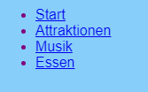

## Hinzufügen weiterer Seiten

Diese Karte zeigt Ihnen, wie Sie weitere Seiten zu Ihrer Website hinzufügen können.

- Klicken Sie oben im Codebereich auf das **+** Symbol neben den Registerkarten und geben Sie einen Namen für Ihre neue Datei ein. Es muss in `.html` (einschließlich des Punktes!) Enden, damit der Browser weiß, dass es sich um eine Webseite handelt.


## \--- Einsturz \---

## title: Umbenennen oder Löschen einer Datei

Wenn Sie den Namen einer Datei ändern möchten, klicken Sie auf das Symbol **cog** rechts neben dem Dateinamen und anschließend auf das Symbol **pencil**. Geben Sie den neuen Namen ein und drücken Sie **Geben Sie**. Sie können eine Datei auch löschen, indem Sie auf das Symbol **bin** anstelle des Symbols **pencil** klicken. 

Sie fragen sich vielleicht, warum Sie den Namen der Datei `index.html` nicht ändern können. `index.html` ist ein spezieller Name, der für die **Homepage** einer Website verwendet wird. Das ist die erste Seite, auf der Sie landen, wenn Sie eine Website besuchen. Wenn Sie auf die Startseite einer Website gehen, sucht der Browser nach der Datei mit dem Namen `index.html` und zeigt sie auf Ihrem Bildschirm an.

\--- / einklappen \---

- Suchen Sie die Datei `blank_page.html` und kopieren und fügen Sie den gesamten Code daraus in Ihre neue Datei ein. Da Sie das Ganze kopieren möchten, können Sie irgendwo auf den Code klicken und die Tastenkombination <kbd>Ctrl</kbd> (oder <kbd>cmd</kbd>) und <kbd>A</kbd> , um alles gleichzeitig auszuwählen.

- Ändern Sie den Text zwischen den `<title> </title>` -Tags, damit Ihre neue Seite einen passenden Titel hat. Trinket zeigt den Titel nicht an, aber Sie können ihn oben im Browserfenster sehen, wenn Sie Ihr Projekt herunterladen.


- Zwischen den `<main> </main>` -Tags in der neuen Datei verwenden Sie die Tags, die Sie gelernt haben, um Dinge wie Seiten, Überschriften, Bilder und Listen zur Seite hinzuzufügen!

- Wiederholen Sie die obigen Schritte für jede neue Seite, die Sie hinzufügen möchten.

Wenn zu viele Registerkarten für Trinket auf einmal angezeigt werden, können Sie die Symbole **<** und **>** in der oberen linken Ecke der Registerkarten verwenden, um zwischen ihnen zu wechseln.


Jetzt müssen Sie Links erstellen, damit Sie zu jeder Ihrer neuen Seiten gelangen können! Lassen Sie uns alle Links in eine Liste einfügen.

- Fügen Sie in der Datei `index.html` dem Textkörper Ihrer Webseite den folgenden Code hinzu:

```html
    <ul>
        <li><a href="index.html">Home</a></li>
        <li><a href="attractions.html">Orte zu besuchen</a></li>
        <li><a href="music.html">Musik</a></li>
        <li><a href="food.html">Dinge zu essen</a></li>
    </ul>
```

- Ändern Sie den Wert des Attributs `href` für jeden Link (denken Sie daran, das ist der Text in den Anführungszeichen), damit er genau mit dem Namen der einzelnen HTML-Dateien übereinstimmt, die Sie erstellt haben.

- Ändern Sie den Text zwischen den `<a> </a>` -Tags in passende Beschreibungen Ihrer Seiten.

Jetzt können Sie zu Ihren neuen Seiten navigieren!

