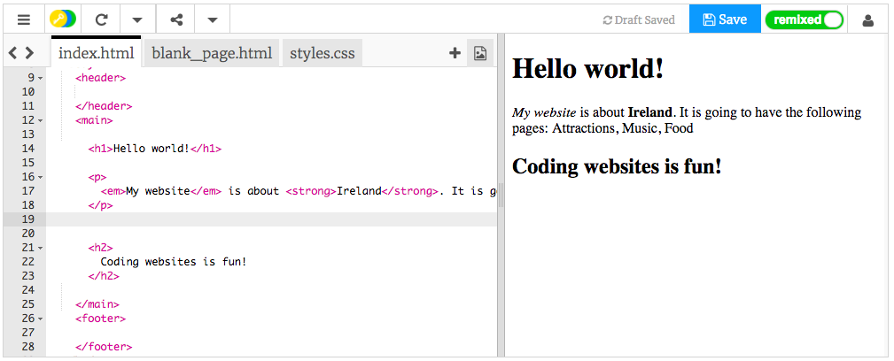

## Your first web page!

- In the left-hand panel, the **code panel**, click on the tab that says "index.html".

- Find the line that says "Welcome to Ireland!" and change it to your own message, being careful not to delete the text `<p>` at the start of the line and `</p>` at the end of the line. You should see your web page updated in the right-hand panel. 


- Now on the same line, change the `<p>` and `</p>` to `<h1>` and `</h1>`. Do you notice any change in the result on the right?
```html
<h1>Welcome to Ireland!</h1>
```

- Try adding a new paragraph or heading to your page using some of these tags.

--- hints ---

--- hint ---
When you want to put text on a page, you need to put it in between two **tags** that tell your browser how to display your text. For example, the `<p> </p>` tags tell the browser it is a new paragraph of text. The `<h1> </h1>` tags tell it that the text is a heading.

A **browser** is the program you use to look at websites, for example Chrome or Firefox.
--- /hint ---

--- hint ---

The code for paragraphs looks like this:
```html
<p>This is one paragraph of text.</p>

<p>This is another paragraph.
Everything in between one set of p tags is displayed together in one long line.</p>
```

--- /hint ---


--- hint ---

The code for headings looks like this:
```html
<h1>This is a heading. It will normally be displayed bigger or bolder than the paragraphs.</h1>
```

--- /hint ---

--- /hints ---

--- collapse ---
---
title: HTML and tags explained
---
**HTML** is the code that makes a web page.

The **.html** in the filename tells the browser that the file is a web page, so it looks for the tags telling it what to display. 

HTML **tags** define different pieces of a page, for example paragraphs and headings, or the body. The pieces are all called **elements**. Think of them as building blocks.

### Why do you need two tags? 
You have an **opening** and a **closing** tag to tell the browser where things **start** and **end**. 
So for a paragraph, the opening `<p>` tag says "here comes some text that I want you to display as a paragraph". The closing `</p>` tag tells the browser where the paragraph ends. 
Everything in between the `<body>` and `</body>` tags is your web page. 
- Notice how the **closing** tag always has a forward slash, `/`.
  
--- /collapse ---

- Try changing the numbers in your **heading** tags to see the different sizes you get. They can go from `<h1>` all the way up to `<h6>`. Remember to change both the **opening** and **closing** tag so that they match.


- Lastly, find the code for the paragraph that says "My website is about Ireland" and change it so that it looks like this:
```html
<p>
  <em>My website</em> is about <strong>Ireland</strong>. 
  It is going to have the following pages: Attractions, Music, Food
</p>
```
  Can you work out what the `<em> </em>` and `<strong> </strong>` tags do?



Congratulations, you've built your first web page! On the next card you'll find out how to control how it looks.


