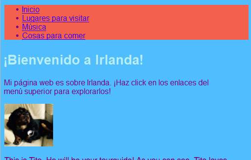

## Hacer una barra de menú

En esta tarjeta verá cómo puede transformar su menú de navegación en una barra de menú de aspecto atractivo, simplemente agregando más reglas de CSS en la hoja de estilos.


- Vaya al archivo de la hoja de estilos en la pestaña `styles.css`. Haga clic en **debajo de** una llave de cierre `}`, y presione **Ingrese** para crear una nueva línea en blanco. Agregue la siguiente regla de CSS:

```css
    nav ul {background-color: tomato; }
```

¿Te das cuenta de cómo usaste dos selectores en lugar de uno? Si usó el selector `ul` por sí mismo, la regla afectaría todas las listas desordenadas en su sitio web. Agregar el selector `nav` también hace que solo se aplique a las listas que están entre `etiquetas nav`.



Deshagámonos de las viñetas. Esos son los puntos delante de cada elemento de la lista.

- Agregue lo siguiente al archivo `styles.css`. Nuevamente, escríbalo en una nueva línea después de `}` para que no esté dentro de ningún otro bloque de reglas.

```css
    nav ul li {list-style-type: none; }
```

Observe que este conjunto de reglas tiene tres selectores: selecciona todos los elementos `li` que están en una lista `ul` que está dentro de una sección `nav`. ¡Uf!


Ahora hagamos la lista horizontal (a través) en lugar de vertical (abajo).

- Dentro de la nueva regla de CSS que acaba de crear, agregue la siguiente línea: `pantalla: en línea;`.


- Los elementos del menú ahora están todos aplastados, así que también agreguemos las propiedades `margen-derecha` y `margen-izquierda` para espaciarlos un poco. El bloque de código CSS debería verse así ahora:

```css
    nav ul li {list-style-type: none; pantalla: en línea; margen-derecha: 10px; margin-left: 10px; }
```

Recuerde: `10px` significa diez píxeles.

¿Qué le parece hacer que el menú cambie para decirle en qué página se encuentra? Esta parte no estará en la hoja de estilos.

- Comience con la página de inicio. Vaya al archivo `index.html`. En la lista de enlaces de menú, elimine las etiquetas de enlace antes y después de la palabra `Inicio`, de modo que el elemento de la lista para la página de inicio sea solo texto entre `<li> </li>` etiquetas, como esta: `<li>Inicio</li>`.

- Ahora vaya a cada uno de sus otros archivos, y haga lo mismo, cada vez que quite las etiquetas de enlace para la página que está editando. Entonces, por ejemplo, en el archivo `music.html` , eliminé las etiquetas de enlace en el elemento de la lista `Music`:

```html
    <header>
        <nav>
            <ul>
            <li><a href="index.html">Inicio</a></li>
            <li><a href="attractions.html">Lugares para visitar</a></li>
            <li>Música</li>
            <li><a href="food.html">Cosas para comer</a></li>
            </ul>
        </nav>
    </header>
```

- Explore sus páginas haciendo clic en los enlaces. Vea cómo la barra de menús muestra la página en la que se encuentra como texto sin formato en lugar de un enlace. 


En la próxima tarjeta aprenderá aún más trucos CSS para que la barra de menú se vea increíble.